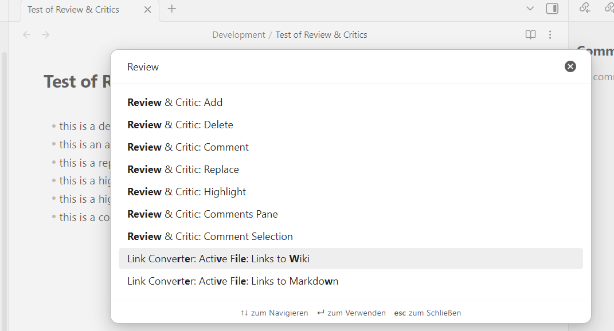
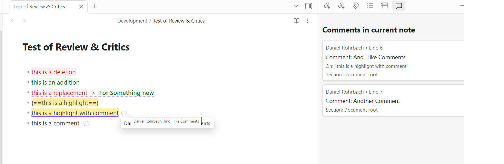
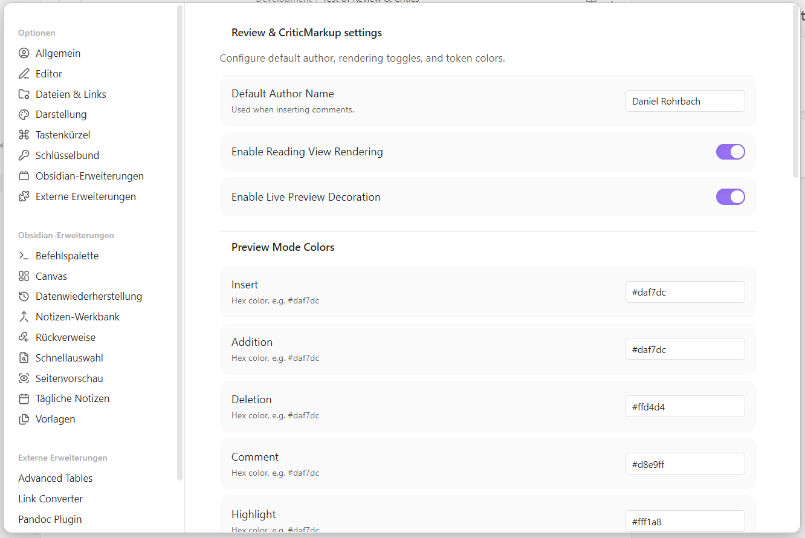

# Review & Critic

Review and comment on Markdown in Obsidian using CriticMarkup-style tokens.

## Features

- Insert standalone and anchored comments
- Mark additions, deletions, highlights, and substitutions
- Render review tokens in Reading View
- Highlight review tokens in Live Preview
- Open a comments pane for the active note and jump to comment locations
- Customize token colors and default author name in plugin settings

## How Features Work

- `Comment`: Inserts a standalone comment token at the cursor.  
  Example: `{>> [author=Daniel] Needs citation here <<}`
- `Comment Selection`: Wraps the selected text in an anchored comment/highlight token so the comment is tied to that text.
- `Add`: Wraps selected text as an addition token.  
  Example: `{++new text++}`
- `Delete`: Wraps selected text as a deletion token.  
  Example: `{--old text--}`
- `Highlight`: Wraps selected text as a highlight token.  
  Example: `{==important sentence==}`
- `Replace`: Converts selected text into a substitution token and lets you fill in replacement text.  
  Example: `{~~old text~>new text~~}`
- `Comments Pane`: Opens a side pane that lists comments for the active note; clicking an item jumps to that location in the note.
- Reading View rendering: tokens are rendered with clear visual styling (for review readability).
- Live Preview rendering: tokens remain editable while still being visually distinct.

## Commands

- `Comment`
- `Comment Selection`
- `Add`
- `Delete`
- `Highlight`
- `Replace`
- `Comments Pane`

## Privacy and Data Handling

- No telemetry or analytics
- No network/API calls
- All parsing and rendering happens locally inside your vault
- Uses Obsidian plugin data storage only for plugin settings

## Compatibility

- `minAppVersion`: `1.5.0`
- `isDesktopOnly`: `false` (desktop and mobile supported)

## Installation

After acceptance into Obsidian Community Plugins:

1. Open `Settings -> Community plugins -> Browse`.
2. Search for `Review & Critic`.
3. Install and enable.

Before acceptance (manual install from a GitHub release):

1. Open the plugin releases page:  
   `https://github.com/rohrbachd/obsidian-review-critics/releases`
2. Click the latest version (or a specific version like `0.1.0`).
3. In the release `Assets` section, download exactly these files:
   - `manifest.json`
   - `main.js`
   - `styles.css`
4. Open your vault folder on disk.
5. Go to `.obsidian/plugins/` inside the vault.
6. Create this folder: `.obsidian/plugins/obsidian-review-comments`
7. Copy the three downloaded files into that folder.
8. In Obsidian, open `Settings -> Community plugins`.
9. If needed, turn off `Restricted mode`.
10. Find `Review & Critic` in the installed plugins list and enable it.
11. Reload Obsidian if the plugin does not appear immediately.

Example Windows path:

`D:\YourVault\.obsidian\plugins\obsidian-review-comments`

## Screenshots







## Development

```powershell
npm install
npm run build
npm run dev
npm run deploy -- "D:\\Path\\To\\Your\\Vault"
```

## Release Checklist

```powershell
npm run build
npm run lint
npm test
npm run release:check -- 0.1.0
```

- Tag must exactly match `manifest.json` version (example: `0.1.0`, not `v0.1.0`)
- GitHub release must include `manifest.json`, `main.js`, `styles.css` as assets

## Automated Release Publish

Prerequisites:

- `gh` CLI installed
- `gh auth login` completed
- clean git working tree (all changes committed)

Full setup + repeatable release steps: [docs/release-workflow.md](docs/release-workflow.md)

One-command end-to-end release:

```powershell
.\scripts\release.ps1 -Type patch
```

What it does:

1. Uses latest published GitHub release as version base
2. Bumps version files (`manifest.json`, `versions.json`, `package.json`)
3. Commits release bump (if needed)
4. Builds + validates release assets
5. Pushes `main`
6. Tags and publishes GitHub release
7. Uploads `manifest.json`, `main.js`, `styles.css`

Alternative npm command:

```powershell
npm run release:auto -- patch
```

## Project Docs

- PRD: [docs/obsidian-review-plugin-prd.md](docs/obsidian-review-plugin-prd.md)
- Obsidian integration/testing: [docs/obsidian-integration-testing.md](docs/obsidian-integration-testing.md)
- Feature usage: [docs/obsidian-feature-usage.md](docs/obsidian-feature-usage.md)
- Publication prep: [docs/Obsidian Publication Guide.md](docs/Obsidian Publication Guide.md)
- Release workflow: [docs/release-workflow.md](docs/release-workflow.md)
- Screenshot capture guide: [docs/screenshots/README.md](docs/screenshots/README.md)
